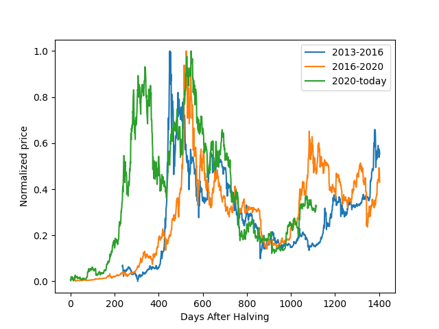
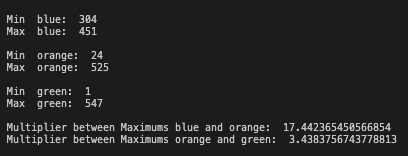
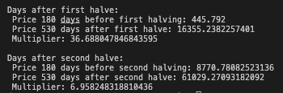

# Bitcoin Halving Cycles: A Detailed Examination of Peak Daily Prices

## Intro

Hello and welcome, Bitcoin enthusiasts! As we stand less than a year away from the next anticipated 'Bitcoin halving', it's the perfect time to delve into this crucial phenomenon. Occurring approximately every four years, these halving events cut the reward for mining Bitcoin in half and kickstart a new 'halving cycle.' But what happens to Bitcoin's peak daily prices during these cycles?

In this in-depth exploration, we turn the spotlight on the complexities of these halving cycles, specifically examining the highest daily price within each one. To give you an authentic depiction of the price dynamics during these periods, we've pulled price data from 2013-04-28, effectively mapping out most of Bitcoin's price rollercoaster.

For the sake of clarity and comparative analysis, we've normalized all price points within each cycle. Then, we set out on a journey to dissect the behavior of these prices, aiming to demystify Bitcoin's price trends during each halving cycle.

And for those who like to dig even deeper, all of the code used in our analysis is available in this same repository.

So, as we edge closer to the next halving, join us in this revealing journey. Let's shed some light on the fascinating interplay between Bitcoin's halving cycles and their influence on the cryptocurrency's highest daily prices!

## Chart analysis



In the presented plot, we've charted three distinct lines, each representing the normalized daily price movement during a Bitcoin halving cycle. These lines offer a visual snapshot of how the daily prices behaved in each cycle.

The blue line represents the price movement in the 2013-2016 halving cycle, the orange line corresponds to the 2016-2020 halving, and the green line illustrates the most recent, 2020-Present halving cycle.

Examining these lines, you can clearly see and compare the price fluctuations and trends that occurred in each halving cycle. This visual representation provides a straightforward way to identify patterns and draw insights about the impact of Bitcoin halving events on its peak daily price.

Although the green line has an early bull market, we can attribute the behavior due to covid19 pandemic macro conditions. All lines hit a price maximum between days 400 and 600. Now, let's take a closer look at the specific days where the cycle maximum is reached.

### Maximum prices as days after halfing

The maximum price points within each halving cycle all occur within a 100-day time period between days 451 and 547. This pattern holds true across all three cycles we've analyzed.



This means that within a 100-day window, the peak daily price for Bitcoin was achieved. It provides us with a consistent time frame in which the greatest price movement occurred in each cycle.

Building on this observed pattern, if the trend continues as we've seen in past cycles, we can predict a possible date for the peak daily price in the upcoming halving cycle. This date would fall within a 100-day window. Accordingly, the projected date for the cycle maximum could be between **July 20, 2025 and October 25, 2025**. But if we narrow our window down to the last cycle maximums, the next one would be between **October 3, 2025 and October 25, 2025**.

Remember, while patterns and trends can give us a clue into possible future behavior, the world of cryptocurrencies is often influenced by various unpredictable factors. Therefore, this projected date should be taken as an informed hypothesis rather than a guaranteed outcome. Also, given the restrictive macro conditions, this upcoming cycle might be different from the last.

## Days before and days after calculator

In the coming months, as we approach the next Bitcoin halving, a popular metric to watch out for is the Bitcoin price 'x' days before and 'y' days after the halving event. This particular measure can provide a keen understanding of how Bitcoin's price behaves around these significant milestones.

DAYS_BEFORE = 180
DAYS_AFTER = 530

To make this even easier for crypto-enthusiasts and analysts, I developed a function that can calculate this metric from the provided data. By simply inputting the desired values of 'DAYS_BEFORE' and 'DAYS_AFTER', you can readily track and analyze the changes in Bitcoin's price surrounding the halving events. This tool will be a valuable asset in our shared journey through the unfolding Bitcoin halving cycle.

```python
DAYS_BEFORE = 180
DAYS_AFTER = 530

def main():
    df1, df2, df3 = read_file(FILE_NAME)
    #halving_prices(df1, df2, df3)
    #halving_max_min_days(df1, df2, df3)
    halving_days_before_after(df1, df2, df3)
    #normalized_graph(df1, df2, df3)
```

Output:



Hope you found this useful!

All the best,
